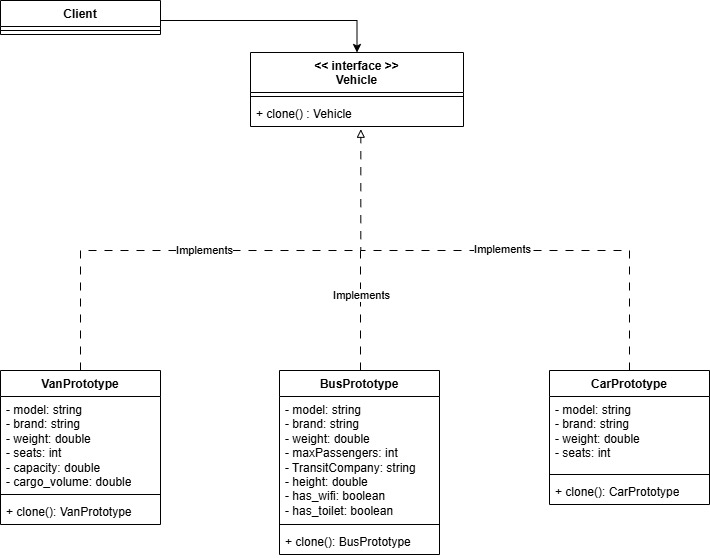
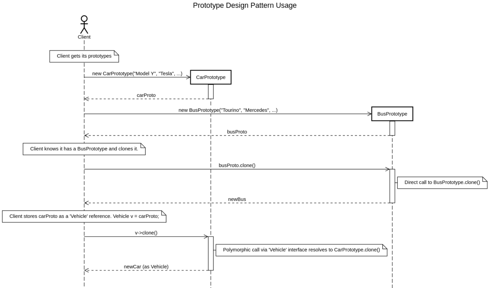

# Prototype Design Pattern Demonstration in C++

This project demonstrates the implementation of the Prototype design pattern in C++, showing how to efficiently clone complex objects with shared resources.

## Authors

- Lucie Desnoyers
- Sadok Lajmi
- Aloïs Vincent
- Mélina Wang
- Zhang Boyang

## Description: Vehicle Management System

The project simulates a vehicle management system with three types of vehicles:
- Cars (Car)
- Buses (Bus)
- Vans (Van)

The goal of the project is to demonstrate the advantages of prototype-based cloning compared to classical object construction.


#### Concept Overview

The *Prototype Design Pattern* allows you to create new objects by cloning existing ones without needing to know their exact type.
This approach is particularly useful when:
- Object creation is complex or time-consuming.
- You want to duplicate objects dynamically through polymorphism.


#### Class Diagram



#### Sequence Diagram



## Core Files
- `vehicle.h` - Abstract base class with Clone() method
- `carproto.h/cpp`, `busproto.h/cpp`, `vanproto.h/cpp` - Vehicle implementations
- `main.cpp` - Demonstration program

---

## Deployment and Usage

#### Dependencies

To build and run this project, you will need:
- `g++` (supporting C++17)
- `make`
- The real-time library (`librt`) for benchmark timing (Linux only)

#### Building (Deployment)

This project uses a Makefile for easy compilation.

1.  Clone the repository.
2.  Navigate to the project's root directory.
    ```bash
    cd Prototype
    ```
3.  Run the `make` command:

    ```bash
    make
    ```
    This will compile all source files and create an executable named `main` in the root directory.

4.  To clean up build files:
    ```bash
    make clean
    ```

#### Running (Usage)

Once built, you can run the demonstration:

```bash
./main
```

#### What to Expect

The program will run a scenario to explicitly demonstrate the value of the Prototype pattern:

1.  **Phase 1: Slow Creation**
    You will first see the prototype instances being created one by one, with a noticeable 500ms delay for each. This simulates a costly initial setup.
    ```
    Creating prototype instances (SLOW)...
    Car created using the constructor (SLOW)
    Bus created using the default constructor (SLOW)
    Van created using the constructor (SLOW)
    Prototype instances created.
    ```

2.  **Phase 2: Benchmark**
    The program will then benchmark creating 5 new `Car` objects using two methods:
    - **Direct Construction:** Calls the slow constructor 5 times.
    - **Cloning:** Calls the fast `Clone()` method 5 times.

3.  **Phase 3: Quantified Result**
    The program will print the time taken for both methods. This explicitly quantifies the pattern's benefit.
    ```
    Direct Car construction : created 5 objects in 25XX ms
    Cloning from Car : created 5 objects in 0 ms
    ```

4.  **Phase 4: Conclusion**
    The program will print a final confirmation that the pattern was successful:
    ```
    Cloning Car is faster than direct construction.
    ```

---

## Core Files
- `Makefile` - The build script for the project.
- `vehicle.h` - The abstract `Vehicle` interface.
- `car.h` / `car.cpp` - The concrete `Car` class (prototype).
- `bus.h` / `bus.cpp` - The concrete `Bus` class (prototype).
- `van.h` / `van.cpp` - The concrete `Van` class (prototype).
- `main.cpp` - The main application, which runs the benchmark and demonstrates the pattern.