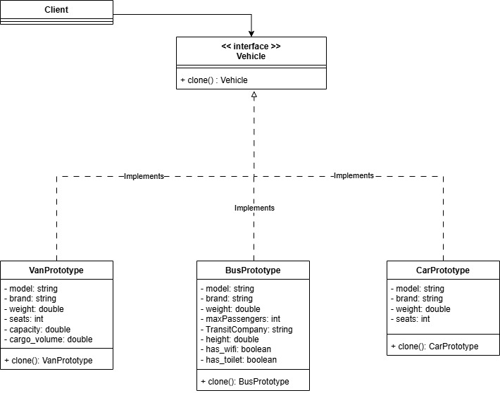
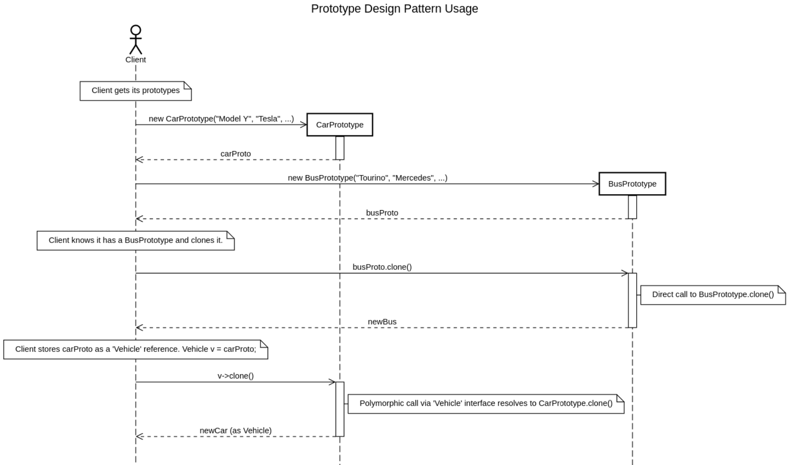

# Prototype Design Pattern Demonstration in C++

This project demonstrates the implementation of the Prototype design pattern in C++, showing how to efficiently clone complex objects with shared resources. 

# Authors

- Lucie Desnoyers
- Sadok Lajmi
- Aloïs Vincent
- Mélina Wang
- Zhang Boyang

# Description: Vehicle Management System

The project simulates a vehicle management system with three types of vehicles:
- Cars (Car)
- Buses (Bus)
- Vans (Van)

The goal of the project is to demonstrate the advantages of prototype-based cloning compared to classical object construction.

## Concept Overview

The *Prototype Design Pattern* allows you to create new objects by cloning existing ones without needing to know their exact type.  
This approach is particularly useful when:
- Object creation is complex or time-consuming.  
- You want to duplicate objects dynamically through polymorphism.  

## Class Diagram

## Sequence Diagram

# Core Files
- `vehicle.h` - Abstract base class with Clone() method
- `carproto.h/cpp`, `busproto.h/cpp`, `vanproto.h/cpp` - Vehicle implementations
- `main.cpp` - Demonstration program
